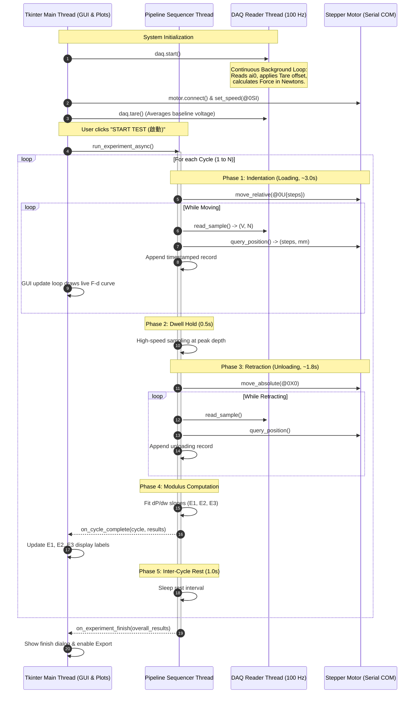
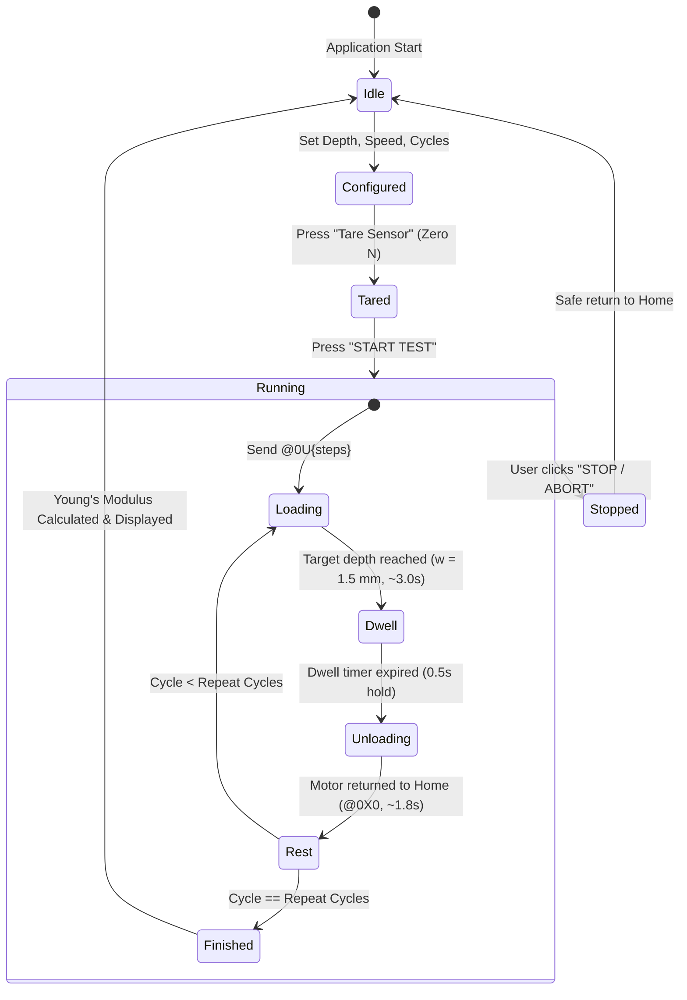
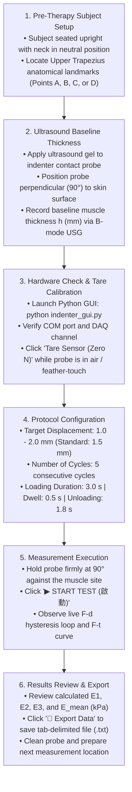
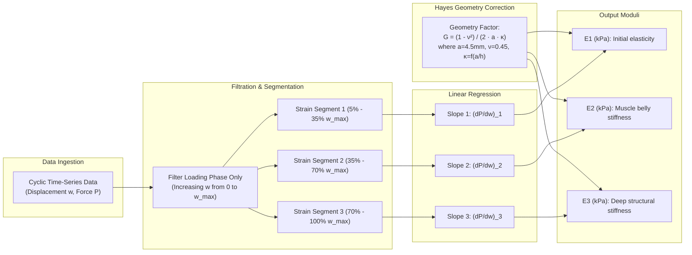
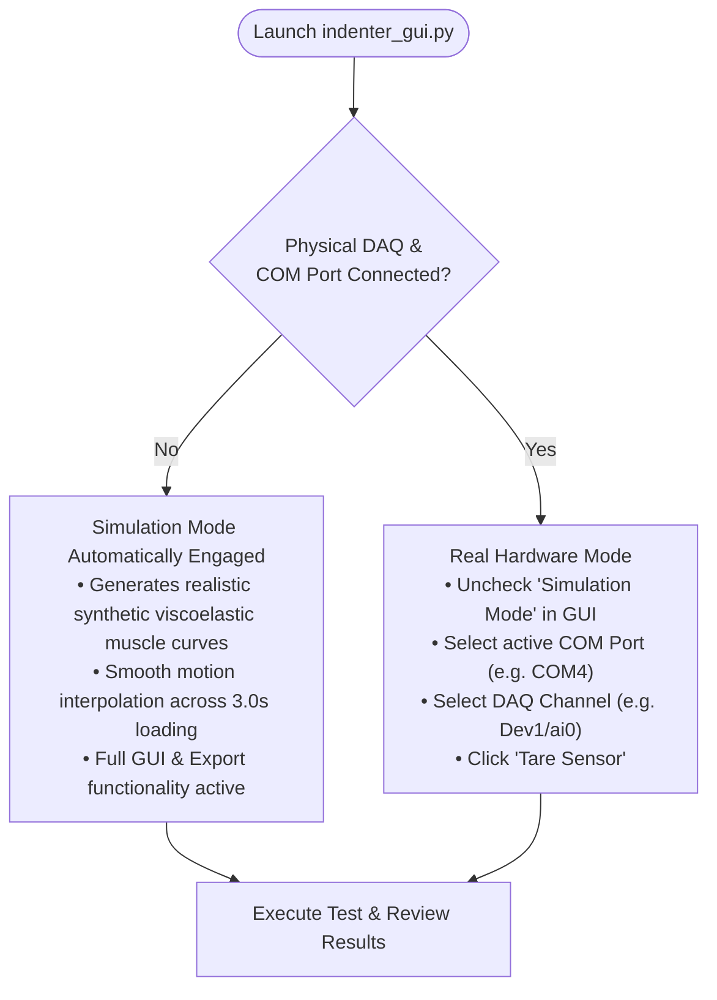

# Automated Muscle Indenter System - Operational & Technical Workflows
> **Detailed Engineering Architecture, State Machines, Threading, and Clinical Protocols**

---

## 1. High-Level System Architecture Workflow

The system is structured as a decoupled, multi-tier pipeline ensuring high-frequency analog data acquisition is never interrupted by serial communications or UI rendering:

```mermaid
graph TD
    subgraph Hardware Layer
        Motor["Linear Stepper Motor (Actuator)"]
        LoadCell["Load Cell Force Sensor"]
        DAQ["NI-DAQ Card (ai0)"]
    end

    subgraph Communication & Driver Tier
        SerialDriver["MotorController (RS-232 / PySerial)<br/>@0SI, @0U, @0X, @0?"]
        DaqDriver["DaqReader (NI-DAQmx Thread)<br/>Tare Zeroing & 100 Hz Sampling"]
    end

    subgraph Orchestration Tier
        Pipeline["IndenterPipeline (Worker Thread)<br/>Cyclic State Machine (5 Cycles)"]
    end

    subgraph Analytical & Visualization Tier
        Youngs["Young's Modulus Engine<br/>Hayes 1972 (E1, E2, E3)"]
        GUI["IndenterApp (Tkinter GUI)<br/>Real-Time F-d Hysteresis & F-t Chart"]
        Logger["File Exporter<br/>Tab-Delimited TXT / CSV"]
    end

    Motor <-->|RS-232 ASCII| SerialDriver
    LoadCell -->|Analog mV| DAQ
    DAQ -->|Voltage Read| DaqDriver

    SerialDriver <--> Pipeline
    DaqDriver --> Pipeline

    Pipeline -->|Synchronized Records| GUI
    Pipeline -->|Completed Cycle Data| Youngs
    Youngs -->|E1, E2, E3 (kPa)| GUI
    Pipeline -->|Batch Records| Logger
```

---

## 2. Multi-Threaded Concurrency Model

To eliminate timing jitter and prevent serial latency from throttling the DAQ rate, three concurrent execution threads run in parallel:



---

## 3. Cyclic Indentation State Machine

Each complete test consists of standardized pressure cycles (typically 5 consecutive cycles) reproducing the mechanical indentation protocol of the clinical study:



---

## 4. Clinical & Operator Step-by-Step Protocol

This protocol guides biomedical engineers and clinicians through performing an indentation test on the Upper Trapezius muscle:



---

## 5. Young's Modulus Extraction & Analysis Pipeline

The Young's Modulus calculation translates raw discrete data points into clinically meaningful tissue stiffness values:



---

## 6. Simulation vs. Real Hardware Operational Workflow

To transition seamlessly between offline software development and physical lab testing:


