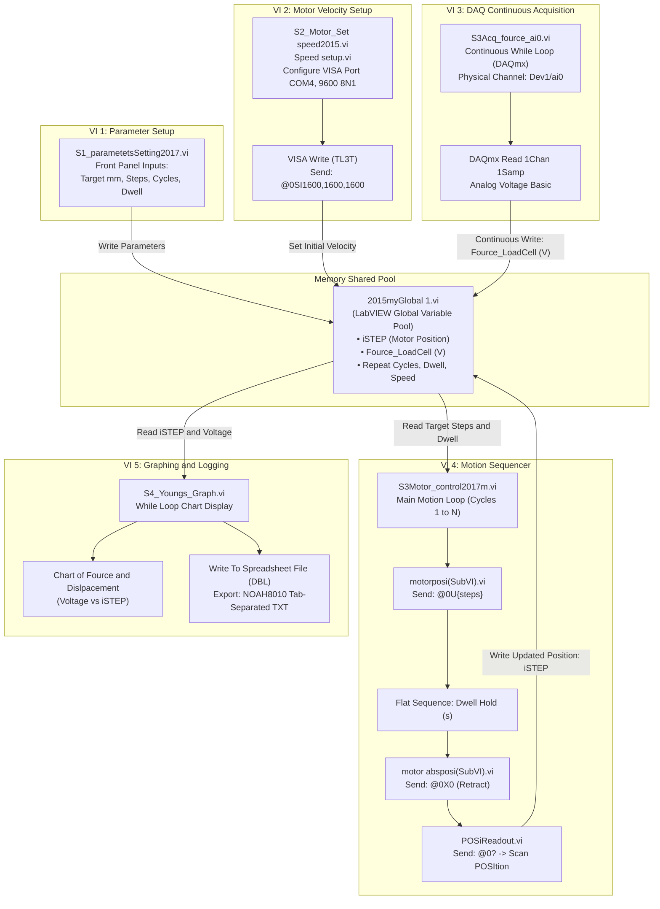
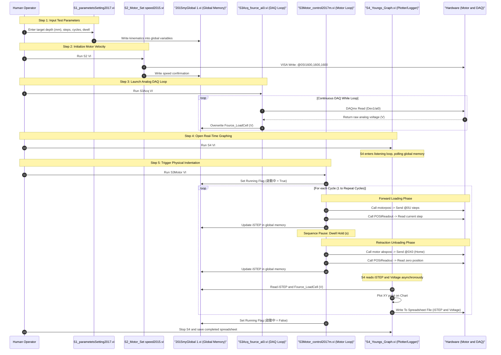

# Legacy LabVIEW Indenter Suite - Architecture & Operational Workflow
> **Technical Documentation of Legacy National Instruments LabVIEW VIs (AU Taiwan Indenter Project)**

---

## 1. Overview of the Legacy LabVIEW Suite

The legacy system consists of five standalone National Instruments LabVIEW Virtual Instruments (`.vi`) and four specialized subVIs. Inter-VI communication and synchronization rely entirely on a LabVIEW **Global Variable** (`2015myGlobal 1.vi`) residing in shared memory.

### Original Execution Order (from `README.txt`)
To operate the legacy system, the operator had to open and manually run four separate VI windows simultaneously:
```
1. S1_parametetsSetting2017.vi   (Define kinematics and cycle parameters)
2. S2_Motor_Set speed2015.vi     (Initialize motor speed over VISA serial)
3. S3Acq_fource_ai0.vi           (Start continuous analog DAQ reading loop)
4. S3Motor_control2017m.vi       (Execute the physical cyclic indentation sequence)
5. S4_Youngs_Graph.vi            (Live XY graph plotting & spreadsheet file export)
```

---

## 2. Legacy System Architecture Diagram



---

## 3. Legacy Inter-VI Dataflow & Sequence Workflow

Because the legacy suite lacked a centralized state machine or thread manager, execution relied on manual operator coordination across parallel VI windows:



---

## 4. Breakdown of Legacy Virtual Instruments (VIs)

### 1. `S1_parametetsSetting2017.vi`
* **Purpose**: Front panel configuration utility.
* **Key Controls**:
  * `前進距離(mm)`: Forward displacement in millimeters.
  * `前進STEP`: Target step count (calculated as $\text{mm} \times \text{steps\_per\_mm}$).
  * `重複次數`: Number of repeat indentation cycles.
  * `速度參數`: Motor pulse frequency.
  * `停留時間(秒)`: Dwell / hold duration at peak compression.
  * `上升時間(秒)`: Retraction duration.
  * `millisecond multiple`: Loop timing delay for LabVIEW scheduler.
* **Mechanism**: Direct unbuffered writes to `2015myGlobal 1.vi`.

### 2. `S2_Motor_Set speed2015.vi` / `Speed setup.vi`
* **Purpose**: Serial driver initialization.
* **VISA Configuration**:
  * Port: `COM4` (or selectable `COM3`/`COM9`), Baud: `9600`, Data: `8`, Parity: `None`, Stop: `1`.
  * Termination Character: `0xA` (`\n` Line Feed).
* **Command Syntax**:
  * Formats ASCII string: `@0SI{start},{top},{accel}\r\n` (e.g., `@0SI1600,1600,1600\r\n`).
  * Writes to VISA serial resource via subVI `VISA Write in Serial Communication for TL3T of VISA.vi`.

### 3. `S3Acq_fource_ai0.vi`
* **Purpose**: Analog voltage acquisition from load cell amplifier.
* **NI-DAQmx Task**:
  * Function: `DAQmx Create Channel (AI-Voltage-Basic)`.
  * Channel: `Dev1/ai0` (or `Dev2/ai0`).
  * Terminal Configuration: `DEFAULT`.
  * Acquisition Mode: `Analog DBL 1Chan 1Samp` in a tight While Loop.
* **Output**: Constantly overwrites global variable `Fource_LoadCell (V)` in memory.

### 4. `S3Motor_control2017m.vi`
* **Purpose**: Hardware motion coordination using 3 specialized subVIs:
  * **`motorposi(SubVI).vi`**: Sends `@0U{steps}\r\n` to advance the stepper motor.
  * **`motor absposi(SubVI).vi`**: Sends `@0X0\r\n` to return to home/retract.
  * **`POSiReadout.vi`**: Sends query `@0?\r\n`, reads serial response line, and scans string `POSItion <value>` to retrieve integer encoder pulses, writing to `iSTEP`.

### 5. `S4_Youngs_Graph.vi`
* **Purpose**: Visualization and raw data file logging.
* **Mechanism**:
  * Reads `iSTEP` and `Fource_LoadCell (V)` from `2015myGlobal 1.vi`.
  * Plots raw voltage versus displacement steps on `Chart of Fource & Dislpacement`.
  * Calls `Write To Spreadsheet File (DBL).vi` with `delimiter (\t)` and format `%.3f`.
  * Generates output data rows matching legacy format (`NOAH8010BEFORETA1`):
    ```text
    1000.000\t0.049\r\n
    1000.000\t0.050\r\n
    ```

---

## 5. Known Bottlenecks and Flaws of the Legacy LabVIEW Suite

Understanding the architectural limitations of the legacy LabVIEW suite illustrates why the Python migration was required:

1. **Global Variable Race Conditions**:
   * `S3Acq` wrote voltage into `2015myGlobal 1.vi` at high frequency, while `S3Motor` wrote `iSTEP` at low frequency over serial.
   * `S4` read both variables independently without thread synchronization or mutual exclusion (mutex). If `S4` read before `S3Motor` updated, multiple identical displacement steps were logged against changing voltages, distorting the $F-d$ curve.
2. **Missing Sensor Tare / Zero Offset Calibration**:
   * The legacy suite saved raw voltage directly without a baseline zeroing routine. As ambient temperature or initial probe resting pressure shifted (e.g. $0.042\text{ V} - 0.050\text{ V}$ baseline drift), the resulting force and elasticity calculations incurred large offsets.
3. **No Automated Young's Modulus Calculation**:
   * The legacy VI only plotted raw Voltage vs. Step count. To calculate Young's Modulus ($E_1, E_2, E_3$), researchers had to manually copy the spreadsheet files into external MATLAB scripts (e.g. Melani 2013 / Firda 2019 scripts) after the experiment finished.
4. **Manual Multi-Window Operator Burden**:
   * The operator had to open, position, and start 4 separate LabVIEW windows in exact sequence. If one window failed to start, the system could drive the motor without acquiring force data, risking tissue overload or actuator stalls.
